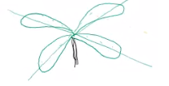

# Bentham and Hooker System of Classification
---

## Beauty of this Classification
* Their system of classification remain unchallenged for 100 years.
* JD Hooker surveyed all area under british rule.
* Bentham surveyed Australia and other eastern.
* Their system of classification took mainly morphological character along with all character possible.
* Hence, called Natural System of Classification.

### George Bentham (1800-84)
### Sir J D Hooker (1817-1911)

* Jointly presented their work in *Genera plantanum*.
* Published by Kew Botanical Garden in three volume (1862-1883)
    * Bentham - *Flora Australinsis*
    * Hooker - Flora of British India
* They laid much emphasis on perianth, and their classification was based on **de Candole**
* They described 97205 plant  species.
* Divided into 21 series, 25 cohort ( now order )and 202 natural order ( families )
* Part of the syllabus of most of the colleges, universities, because it is based on morphological Character and also first detailed Natural System of Classification. 

##Phanerogams (division of seed bearing plants)

###Dycotyledon (class)
* Reticulate Venetion
* Tetramerous and Pentamorous flower 
    * #### Polypetalae (subclass)
        * ##### Thalamyflorae (Series I)
            * ###### Ranales (order)
                * ### Rannunculacae  
                    * Both marginal and basal.
                * ### Magnoliaceae
                    * Marginal
                * ### Annonaceae
                    * Basal Placentation 
                    * Flower Trimerous (Demerit)
            * ###### Perietales (order)
                * ### Papavaracae
                    * Colourful Latex Present
                    * Capsule Fruit
                    * Calyx Cadipus ( Cadipus : shoprt lived)
                * ### Brassicaceae (formerly known as crusiferacy : crusi form corolla) 
                  
                    * Stamen Tetramerous
                    * Bilocular Ovary ( divided by fasle septum fruit )
                    * Fruit siliqua / Silicula
                * ### Capparifdaceae
                    * Androphore or Gynophore 