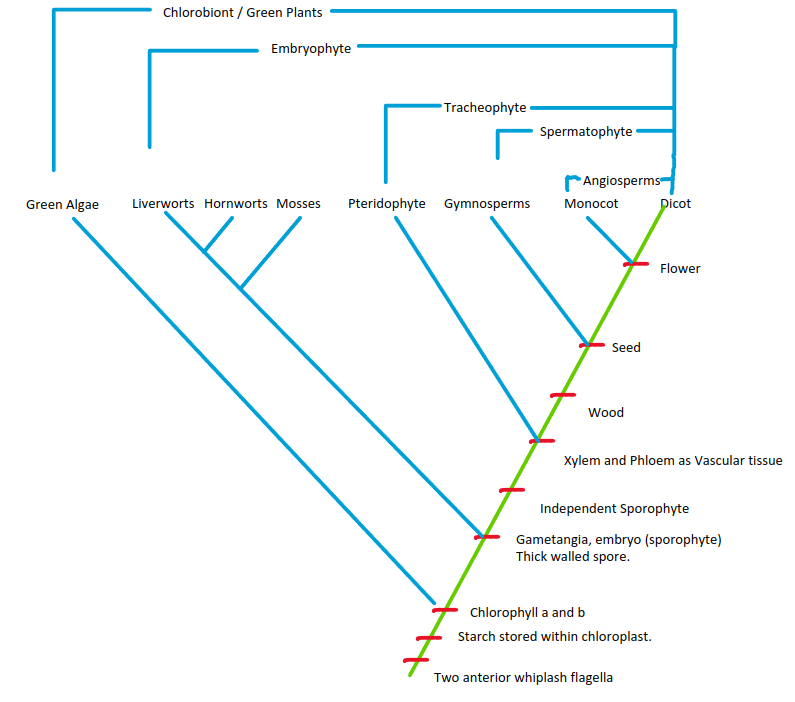

# Plant Science

## Green Pants 
* Presence of photosynthetic pigment a and b. 
* Storage of Carbohydrate as Starch.
* Presence of 2 anterior whiplash flagella ( at some stage of life cycle / often modified or lost. ) 

### Plant Science
The study of plants treated as equivalent to land plants.

### Botany
It is study of most organism traditionally treated as plants including all photosynthetic eukaryotes & other eukaryotes having cell wall and spores. [Broader than Plant Science] 

### What is Biological Classification?
The art of Identifying distinction among organism and placing them in groups, that reflect their most significant character and relations.

### Purpose of Biological Classification

* Categorization
* Naming
* Remembering
* Study

## G.Simpson (1961)

### Systematics

Systematics is the study of Diversity of organism and all their comparative and evolutionary relationship based on comparative morphology, comparative anatomy, comparative ecology, comparative physiology, and comparative biochemistry.

### Taxonomy

He considered taxonomy as the study of principle and procedure of Classification.

### Classification

He considered classification as sub-topic of systematics that deals with ordering of organism into groups (grouping).

## History

### Parashar

* Dwimatrika (Dicotyledon) Jalkaparn [reticulate venation]

* Ek Matrika (Monocotyledon) maujalaparn [parallel venation]

### Theophrastus(370-280 BC)

Father of Botany

### John Ray

1800 plant and animal

### Carolus Linnaeus

Father of Taxonomy

Swedish

*Species plantarum*

### Alde Jussien

First Natural System of Classification

### George Bentham & Joseph Dalton Hooker

Genera Plantarum

Flora of British India (JD Hooker)

### AW Eichler

Phylogenetic System

### Adolf Engler and Karl Pranth

### Charles Edwin Bessy

Followed Bentham and Hooker System

### John Hutchinson

Genera of Flowering Plants

### Armen Takhtajan

### Aurthur Cronquist

Phygenetic System

### APG System [ Angiosperm Phylogeny Groups ]

* APG I  [1998]

* APG II [2003]

* APG III [2009]

* APG IV [2018]

### Artificial Classification

Very few characters are considered like habitat, their importance to human being.

    Theophrastus System and Secundrus (23-79 AD)

### Natural Classification

Use as many possible character for classification

    Ex- Adanson, Alde Juisieu, AP de Candols, Bentham & Hooker

### Phylogenetic Classification

Use of many characters along with evolutionary interpretation

    Eicher, Engler & Pranthles, Bessy, Hutchinson, Thaktajan, Cronquis, Dahlgren,  Thorne, etc. 