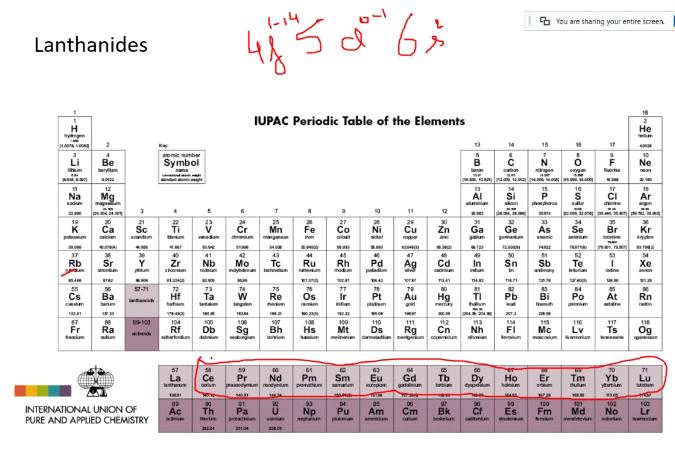

#Lantanids
inner transistion metals : Not similar to Transistion metals.

First element in the series is Cereium (first e- filling in f-orbital)
##Oxidation State
* Most common oxidation state +3
    * Due to loosing 2 - 6s2
    * Due to loosing 1 - 5d1
* +2 and +4 are also stable

Element | Oxidation States 
--- | ---
Eu | +2 (due to half filled stability)
Tb | +4
Yb | +2 (due to fully filled stability)

##Configuration
Eu is odd since half filled stability
Tb 

##Atomic Sizes
* No change in size between Zr -> Hf due to Lanthanid Contraction
* F orbital has poor shielding effect.
* On moving Ce to Lu:
  * decrease in size//not increase
  * due to poor shielding of 4f

##Handouts
* [LibreTexts - Lantanides](./Lanthanides.pdf)
* [LibreTexts - Contraction](./Lanthanide Contraction.pdf)