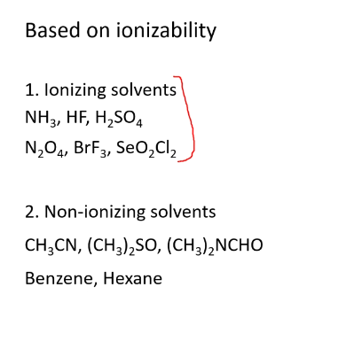

#Classification of Solvents
##Based on Polarity

###Polar Protic Solvents
NH3, HF, H2SO4, H2O
###Polar Aprotic Solvents
   * Don't have proton N2O4 , BeF3 , SeO2Cl2
   * Have proton, but it is not attached to enough electronegative.
    CH3CN, CH3)2SO, CH3)2NCHO

     
##Based on Ionisation
###Ionizing solvents
 
###Non- Ionizing solvents
    We cant add protron, or write auto ionization equation.
Solvents | Common Name
---|---
CH3CN | Acetonitrile
(CH3)2SO | Dimethyl Sulfoxide (DMSO)
(CH3)2NCHO | Dimethyl formamide (DMF)

###Based on acidic/basic nature

###Liquid Ammonia as non aqueous solvent
* Liquid Ammonia is the most studied non-aqueous solvent.
* Its physical properties 