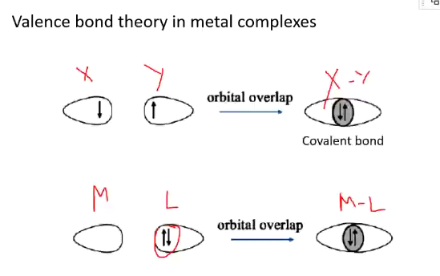
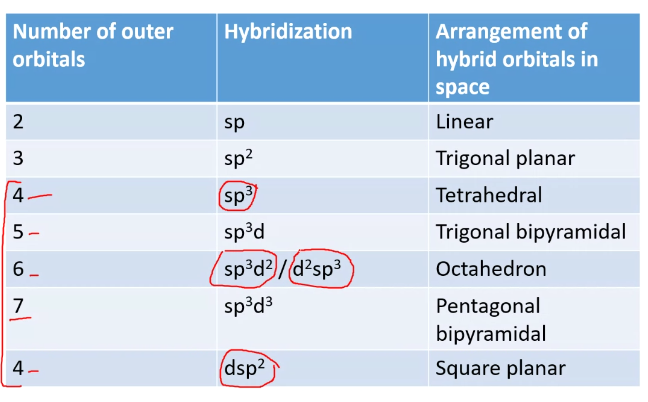
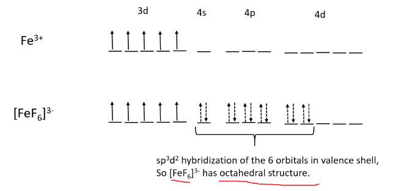
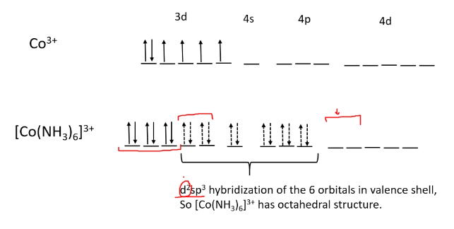
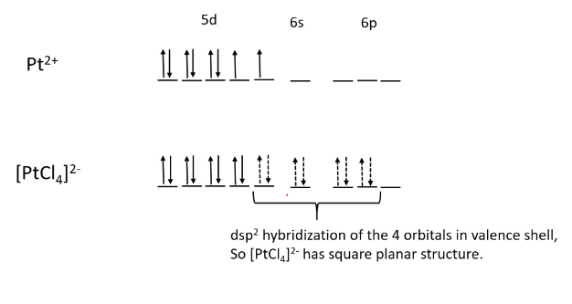

#Covalent Bond

**Dative bond**: When both the electrons are coming from one operand.

#Hybridization Shapes

###[FeF6]3- 

**Magnetic Movement**: Bohr Magnetron
/formula/

###[Co(NH3)6]3+

* Halogens, O --> High Spin
* C, N        --> Low Spin
[from crystal field theory]
  
###[PtCl4]2-

##Limitation of VBT
* When we predict structure of we can't differentiate on Weak Field Ligand and Strong Field.
* Colours can't be explained.

###[Hand-outs](./VBT.pdf)