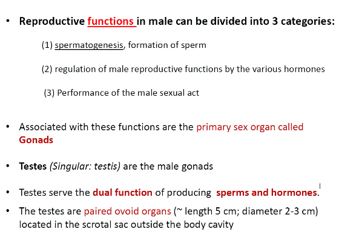
 # Testis
## Reproductive functions in male can be divided into three categories.
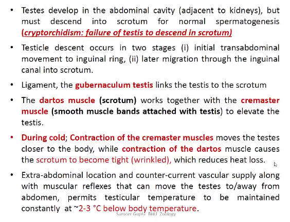
* Testes develop in the abdominal cavity (adjacent to kedneys), but must descend into scrotum for normal spermatogenesis. **(cryptrochidism : failture of testis to descend in scrotum)
* Testis descend occurs in two stages
  (i). initial transabdominal movement to inguinal ring,
  * later migration through the inguine canal to scrotum.
    
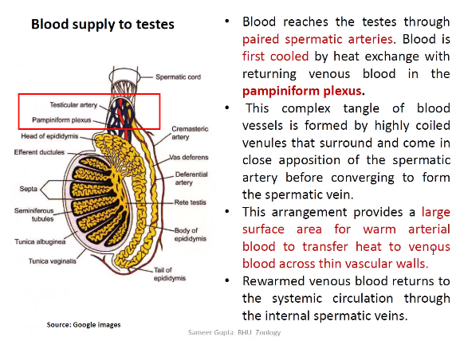
## Blood Supply to Testis

* Blood reaches the testes through paired spermatic arteries. Blood is first cooled by heat exchanges with returning venous blood in the **pampiniform plexus**.
* This complex tangle of blood vessels is formed by highly coiled venules that surround and come in close apposition of the spermatic artery before

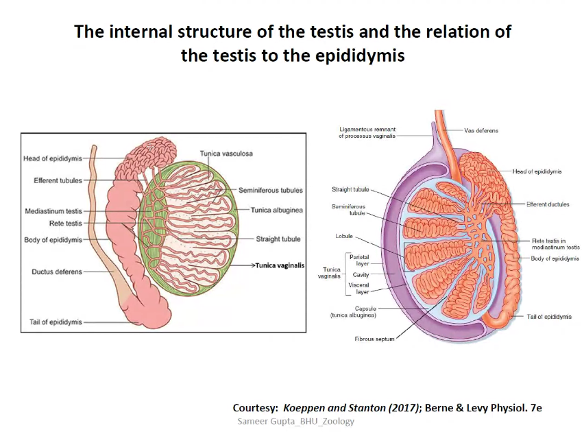
* Tunica vaginalis maintain the shape most outer layer
* Cavity to prevent heat exchange
* Main body is madeup of Capsule called *Tunica Albugenia*
* Lobule { Semeniferous Tubules
* Epidydymis -
    * 
  
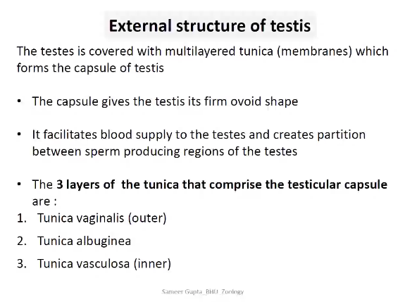
## External Structure of Testis
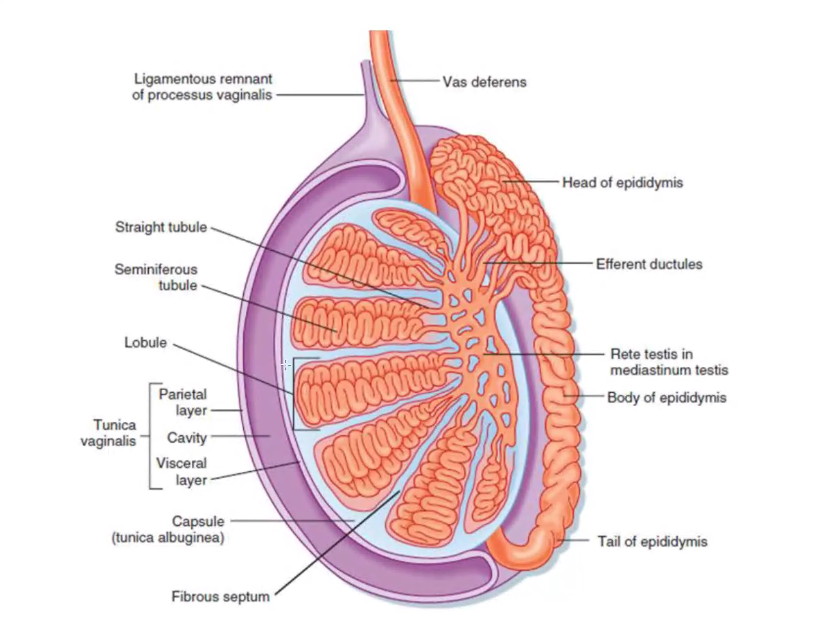

The testes is covered with multilayered tunicac

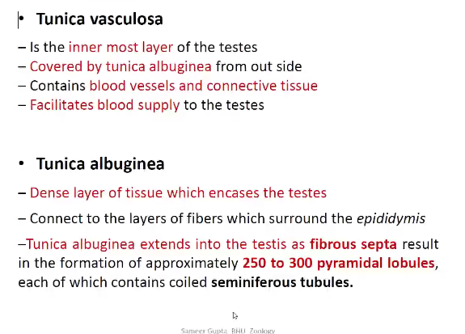

### Tunica Vasculosa
* Is the inner most layer of the testes
* Covered by tunica albu

### Tunica Vaginalis

* Overlying *tunica albugenia*
* They are two

## Tubular Network of Testis (Internal Strucures of testis)
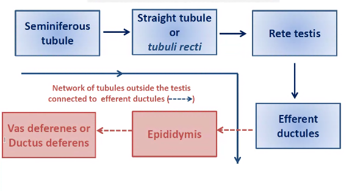
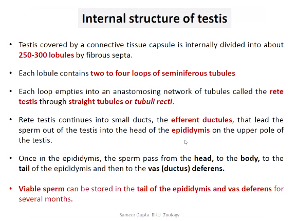
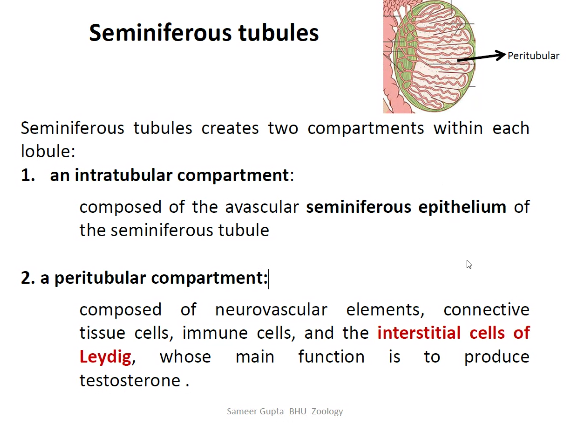
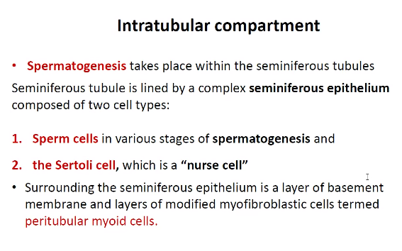
myoid cell mean muscle like, not muscle cell, because its cytoplasm contain muscle fibre.
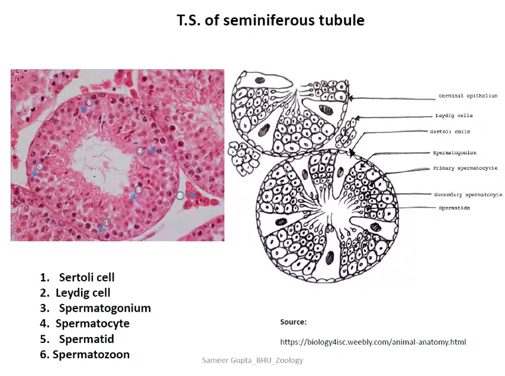

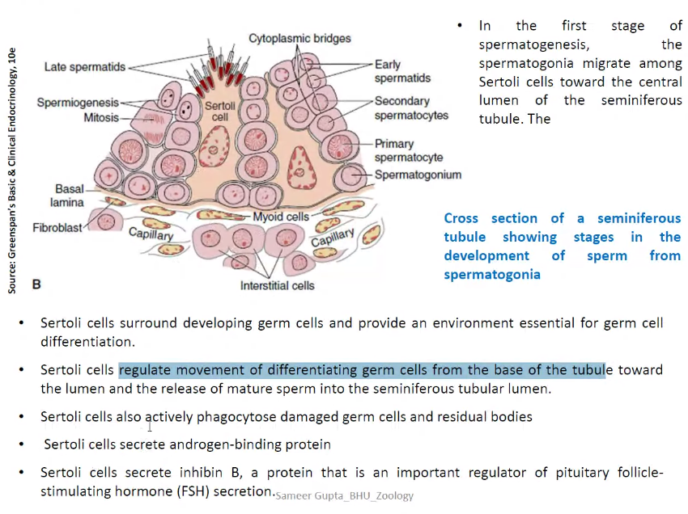
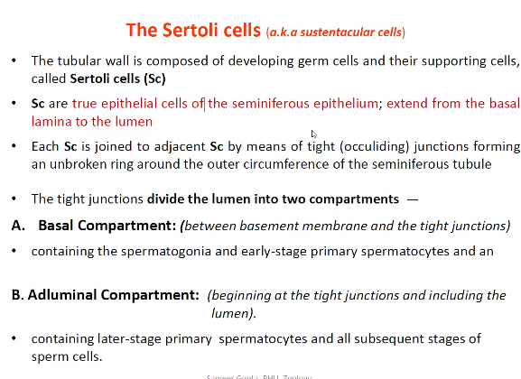
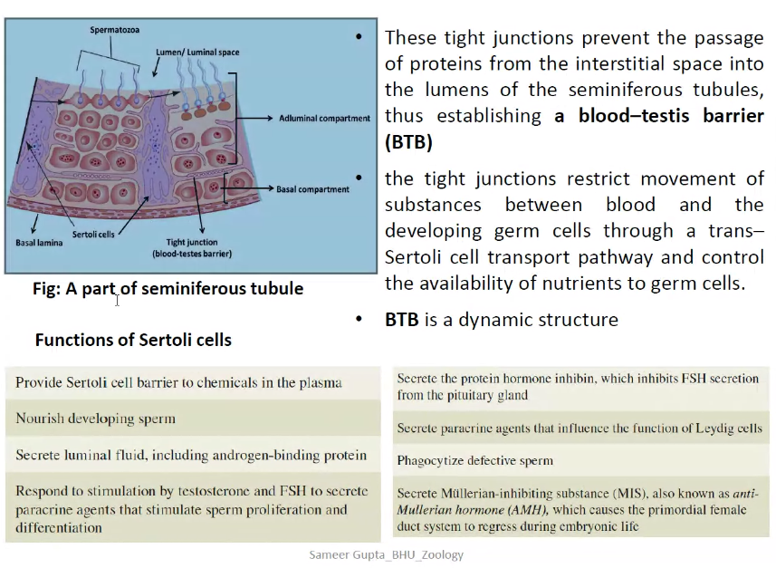
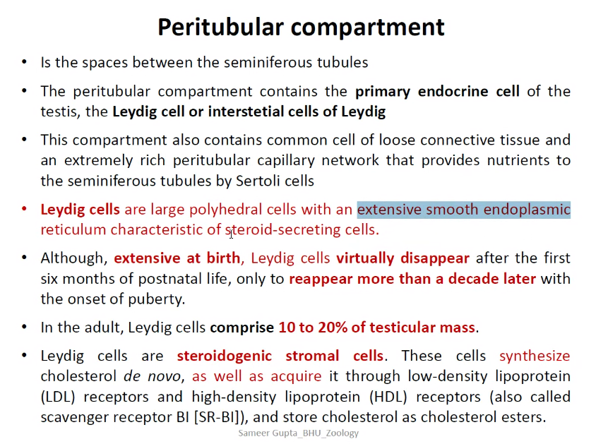
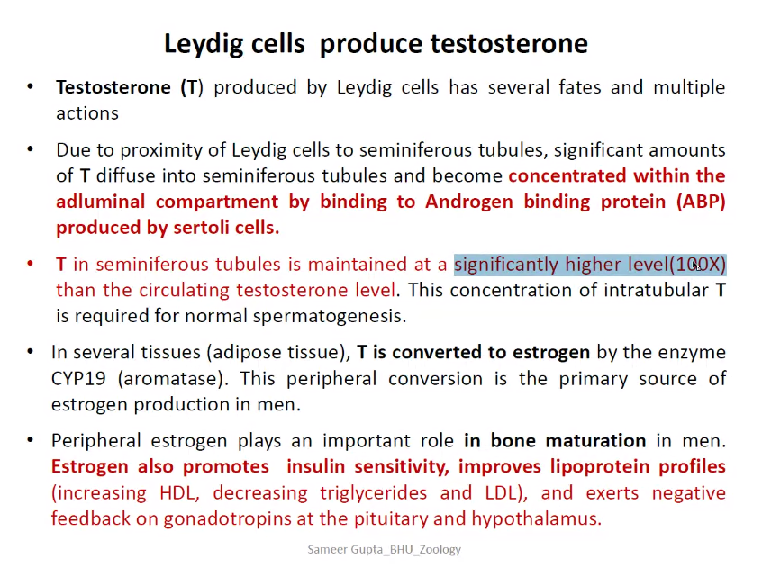

testestrone aromatise to form estrogen

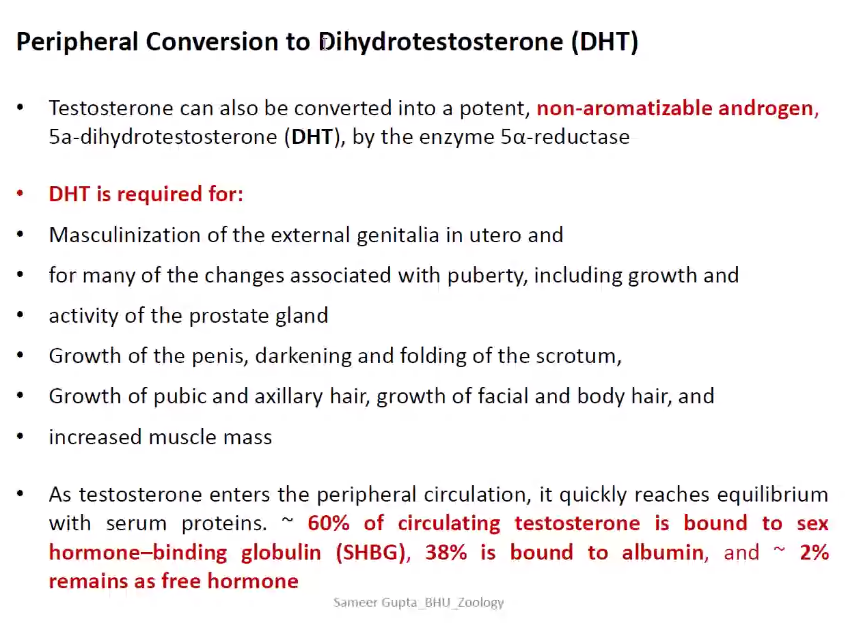