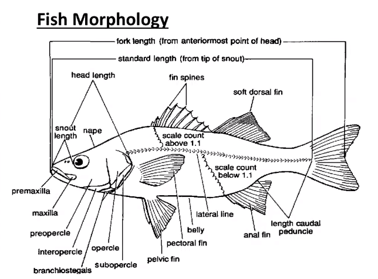
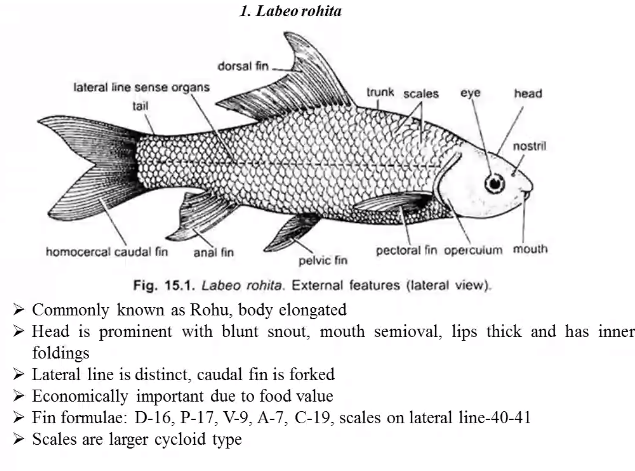
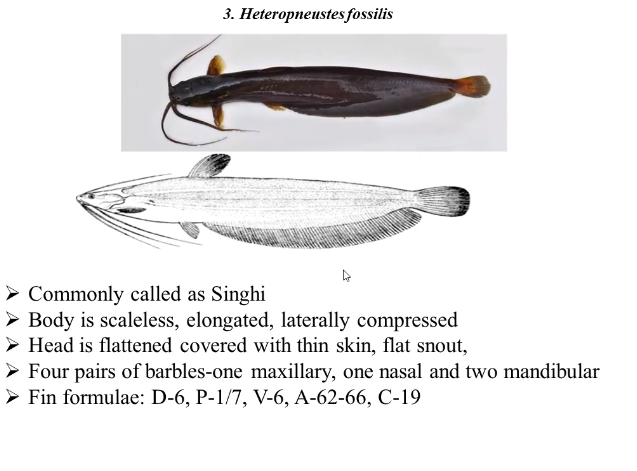
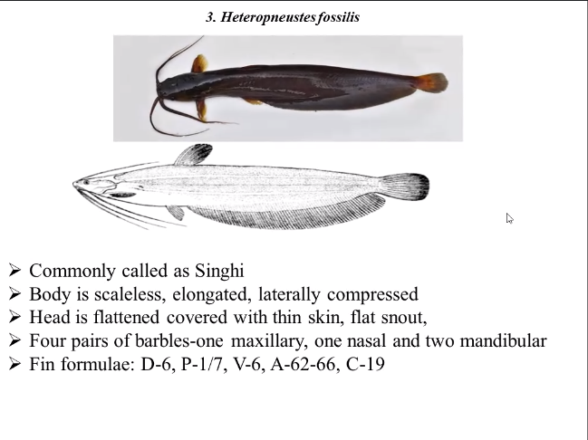

Thursday
sericulture
apiculture
exam
max 3 pages
Thursday
Singarawal Sir
Email pdf
Practicals on Saturday probably

classification must be mentioned

order siprinoformis
genus lebio
rohita

fin formula
D dorsal
P pectoral
V ventral/pelvic
a anal
c caudal

Katla

cycloid type of scale

Singhi

mangur well developed acessory respiratory organs

