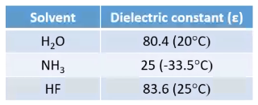

---
## Contents
* [Introduction](index.md)
* [Classification](classification.md)
* [Solvent](solvents.md)
---

## Importance of Solvent
* Solvent provides ideal medium to achieve rate of reaction.
* Most of the violent reactions can be slowed down  by the use of solvent.
* In many cases it is possible to separate the desired product from other products from the reaction based on solubility difference.
* Many reagents can be conveniently or safely handled in solution than in pure state.
___
## Solubility Products
___
## Properties of Solvent
###Physical Properties
####Melting and Boiling Point of solvent
  * It indicates the range of temperature across which a substance exists in liquid state.
  * A larger range is better.
    

####Heat of fusion and Heat of vaporization
  * Heat of fusion is the energy needed for one gram  of a solid to melt without any change in temperature and \
  * Heat of vaporization is the amount energy required for one gram of liquid to vaporize(boil) without a change in pressure.
  
  

####Dielectric Constant (relative permittivity)
  * The dielectric constant is a physical property that has a dimensionless numeric value for every solvent.
  * It determines the ability of the solvent ionic substances.
  * For instance large dielectric constant of water means that the force between the ions in a solute has been reduced enough to permit ions to separate. These separated ions become surrounded by the oppositely charged ends of solvent dipoles and become solvated. This ordering reduces the thermal motion of the solute molecules.

      
####Dipole Movement
* The electric dipole moment is a measure of separation of positive and negative electrical charges.
* It gives a measure of the solvent's overall polarity.
    
####Viscosity
* For any solvent, low viscosity is favorable as it leads to good dispersion followed by dissolution of solute molecules.
* The product with low solubility easily precipitates out from low viscosity solvents.
* Crystallization of products is much better in low viscosity solvents.
### Storage and Handling of Dangerous Chemical
* Storage of BF3 in Diethyl ether.

* 
