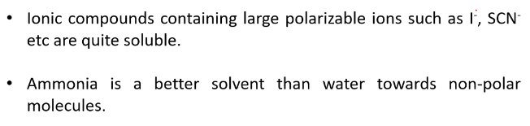
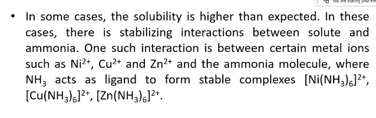
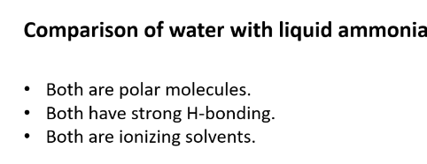
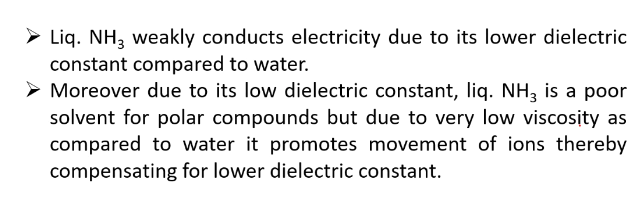

###Liquid Ammonia as non aqueous solvent
* Liquid Ammonia is the most studied non-aqueous solvent.
* Its physical properties resemble water to a large extent.
* THe lower dielectric constant results in a general reduced ability to dissolve the ionic compounds especially those containing highly charged ions such as CO32-, SO42-, PO43- which are practically insoluble.
* Ionic compounds contaning large polarizable ions such as I-, SCN

