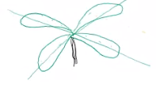

# Bentham and Hooker System of Classification

---

## Beauty of this Classification
* Their system of classification remain unchallenged for 100 years.
* JD Hooker surveyed all area under british rule.
* Bentham surveyed Australia and other eastern.
* Their system of classification took mainly morphological character along with all character possible.
* Hence, called Natural System of Classification.

### George Bentham (1800-84)
### Sir J D Hooker (1817-1911)

* Jointly presented their work in *Genera plantanum*.
* Published by Kew Botanical Garden in three volume (1862-1883)
    * Bentham - ***Flora Australinsis***
    * Hooker - Flora of British India
* They laid much emphasis on perianth, and their classification was based on **de Candole**
* They described 97205 plant  species.
* Divided into 21 series, 25 cohort ( now order )and 202 natural order ( families )
* Part of the syllabus of most of the colleges, universities, because it is based on morphological Character and also first detailed Natural System of Classification. 

1. hive
2. cunh34
3. 5667
4. 

##Phanerogams (division of seed bearing plants)

###Dycotyledon (class)
* Reticulate Venetion
* Tetramerous and Pentamorous flower 
    * #### Polypetalae (subclass)
        * ##### Thalamyflorae (Series I)
            * ###### Ranales (order)
                * ### Rannunculacae  
                    * Both marginal and basal.
                * ### Magnoliaceae
                    * Marginal
                * ### Annonaceae
                    * Basal Placentation 
                    * Flower Trimerous (Demerit)
            * ###### Perietales (order)
                * ### Papavaracae
                    * Colourful Latex Present
                    * Capsule Fruit
                    * Calyx Cadipus ( Cadipus : shoprt lived)
                * ### Brassicaceae (formerly known as crusiferacy : crusi form corolla) 
                  
                    * Stamen Tetramerous
                    * Bilocular Ovary ( divided by fasle septum fruit )
                    * Fruit siliqua / Silicula
                * ### Capparifdaceae
                    * Androphore or Gynophore 