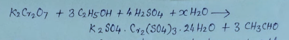

Magnetic Movement 3.87 BM

## Procedure

* 2.75g of Oxalic acid and 1.2 g potassium oxalate are dissolved in 50mL distilled water in a beaker by heating the solution in water bath and keeping the temperature below 70* C.
* Now add 1.0g potassium dichromate in small portions (pinch by pinch) with constant stirring with a glass rod. When the reaction ends,
* Filter using filter pump, excess oxalic acid is washed with alcohol (1mL ehanol, if excess oxalic acid will make
* Dry the compound in open air, weigh,

Calculation:
Mol. wt. of K3[Cr(C2O4)3].H2O
 Theoretical Yeild
 294g K2Cr2O7 reacts to give two moles of complex

 # Experiment 2
  Object : Preparation of double salt, potassium chromium sulphate dodecahydrate (chrome alum) Cr2(SO4)3.24H2O

  Chemical required:
    K2Cr2O7 2.5g
    conc. H2SO4 2ml
    Ethanol 2ml

   Reaction
   

Procedure
 * TAke 10ml distilled water in a beaker and add 2ml conc. H2So4 into it.
 * Now add 2.5 g K2Cr2O7 in small lportions(pinch by pinch) in the above reation to dissolve in it.
 * Put this beaker in ice water bath and add 2ml of ethanol dropwise with stirring.
 * Now keep the beaker as such til the crystals are appeareed. when the crystalisation is complete, filter off crystals in Buchner funnel and wash with a very small amount of water.
 *

 Precautions
 Do not permit the temperature to rise above 60*C. Above this temp, complex of Cr(So4)

 % yeild = observed yeil*100% d/ theoretical yield

 Experiment 3
 Preparation of Bis