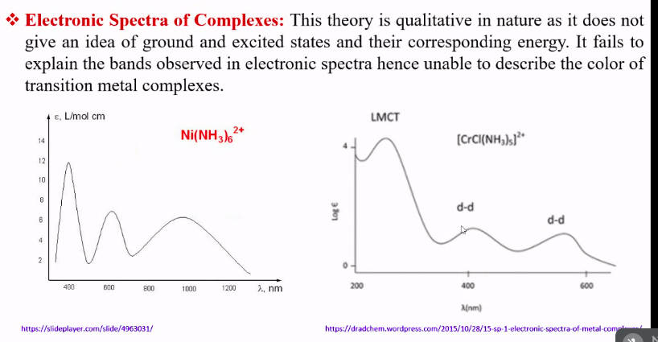
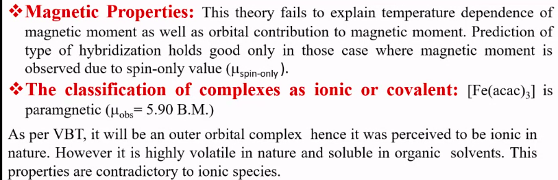
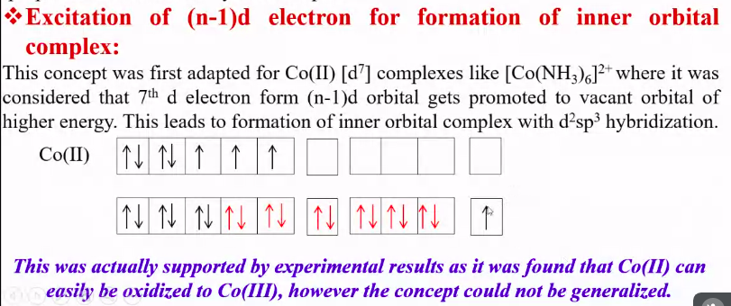
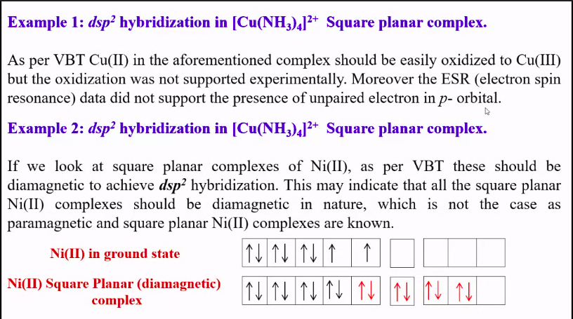
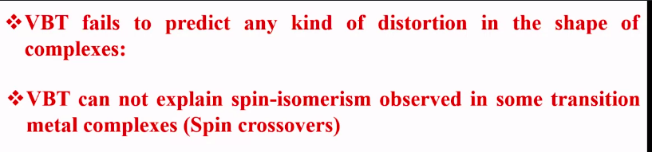

### Electronic Spectra of Complexes
This theory is qualitative in nature as it does not give an idea of ground and excited states and their corresponding energy. It fails to explain the bands observed in electronic dpectrs hence unable

### Magnetic properties

VBT fails to explain temperature dependence of magnetic movement as well as orbital contrubution to magnetic movemnt. Prediction of type of hybridization holds good only in those case where magnetic movement is  observed due to spin-only value (mu-spin only.)

### The classification of complexes as ionic 
or covalent:
[Fe(acac)3] is paramagnetic (`mu` observed = 5.90 BM)

As per VBT, it will be an outer complex 

if an atom is absorbing energy then it would lead excitation of electron and jump but it should be followed by emitting of 

cunh34+ exception iis wrong explained.

