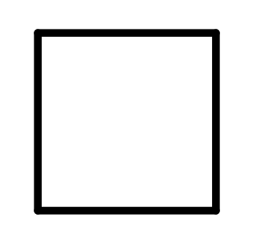

## Cycloalkanes / Cycloparaffine
*includes saturated hydrocarbons*

### Preparation
in the cyclic compounds the two ends of the chain come together and one hydrogen is removed from, to form a cyclic ring.

### General Formula
CnH2n

### examples

Molecular Formula | Name | Structure
--- | --- | ---
C3H6 | Cyclopropane | 
C4H8 | Cyclobutane | 
C5H10 | Cyclopentane | 

### Nomenclature

- Name of parent chain : Count the number of Carbon in ring, if no. of carbon is greater than same in substitution, the substitution is given the prefence in name.
- 

