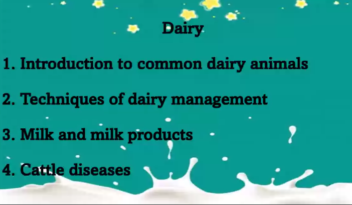

# Dairy

1. Introduction to common dairy animals.
2. Techniques of dairy management.
3. Milk and milk products
4. Cattle Disease

### Sources
* Shukla and Upadhayay

The dairy industry, covering the production, processing,  

## Farm Houses
1. The processing of the milk by the factory system

## Milk
udder - mammary gland of cattles

## Processing of Milk
